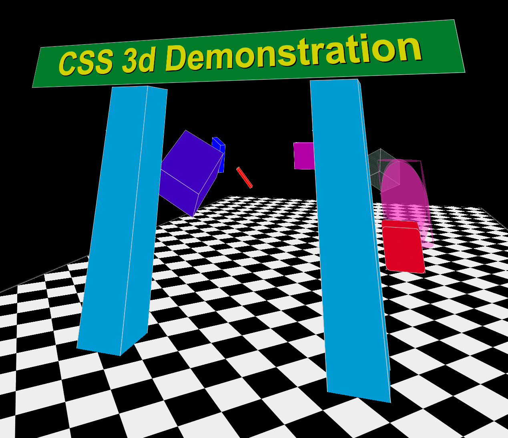

# CSS 3D-Engine

A Javascript 3D Engine using CSS transformations.

[Interactive Page](https://lischilpp.github.io/css-3d-engine/)

## Features
- First person controller with adjustable parameters
- Jump physics
- Shapes such as Cuboid and Plane

## Screenshot

